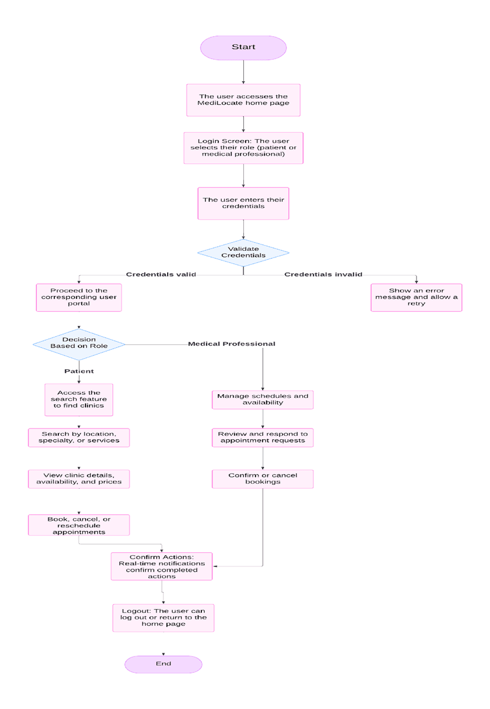
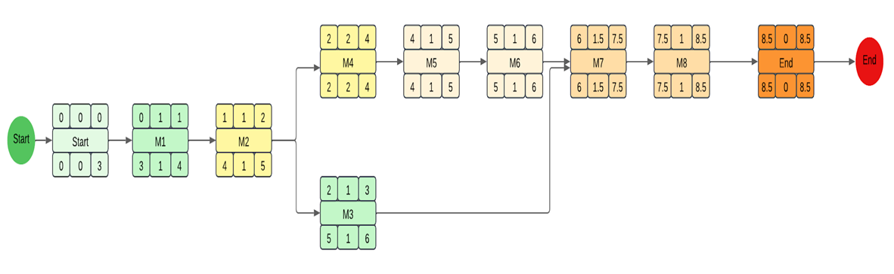
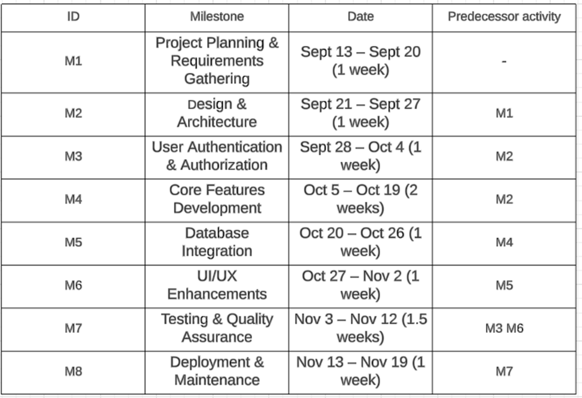

ENSE 374 – Software Engineering Management

Adriana Carolina Garcia Serrano (200535537)

To correct the links in the provided Markdown file, I'll align them with the project structure you've shared. Here's the corrected file:

### Table of Contents

- [**Introduction**](#introduction)
- [**Design Problem**](#design-problem)
    - [Problem Definition](#problem-definition)
    - [Project Charter](#project-charter)
- [**Solution**](#solution)
    - [Solution 1](#solution-1)
    - [Solution 2](#solution-2)
    - [Final Solution](#final-solution)
        - [Table 1: Solution Comparison](#table-1-solution-comparison)
        - [Components](#components)
        - [Features](#features)
        - [Environmental, Societal, Safety, and Economic Considerations](#environmental-societal-safety-and-economic-considerations)
        - [Limitations](#limitations)
- [**Teamwork**](#teamwork)
    - [Meeting 1](Documentation/Meeting%20Agenda/Meeting%201.docx)
    - [Meeting 2](Documentation/Meeting%20Agenda/Meeting%202.docx)
- [**Project Management**](#project-management)
- [**Conclusion and Future Work**](#conclusion-and-future-work)
- [**References**](#references)

### List of Figures

- [Block Diagram (Fig. 1)](Documentation/Images/block_diagram.png)
- [Gantt Diagram (Fig. 2)](Documentation/Gantt%20Diagram.xlsx)
- [Activity Diagram (Fig.3)](Documentation/Images/activity_diagram.png)

### List of Tables

- Table 1: Solution Comparison.
- Table 2: Features of MediLocate.
- Table 3: [Activity Diagram Table](Documentation/Images/table3.png)

Here’s the updated Markdown with clickable links that redirect to the respective files based on the provided references:

---

# Introduction

MediLocate is a web-based application designed to streamline how Canadians book medical appointments, addressing common frustrations like long wait times and communication barriers. Traditional appointment booking methods are often inefficient, leaving patients frustrated and clinics overwhelmed. MediLocate offers a user-friendly platform for patients to easily schedule appointments and for medical staff to manage their availability.

The rationale for this project stems from the urgent need to modernize healthcare access. With the rise of digital solutions, there’s a clear demand for a platform that simplifies the booking process while maintaining flexibility and reliability for both patients and healthcare providers. MediLocate’s design aims to fill this gap by providing a seamless and accessible solution.

### Project Requirements

Stakeholders have outlined the following key requirements for MediLocate:

- User-Friendly Web-Based Platform:
    Create an accessible platform. It should be intuitive for all users, offering quick and clear navigation.

- Secure User Authentication:
    Ensure secure and seamless access for patients and medical staff.

- Enhanced Appointment Scheduling:
    Provide an intuitive interface for booking, canceling, and managing appointments.

- Real-Time Updates:
    Enable live availability tracking for patients and providers.

- Search and Filtering:

Users should search clinics by location, specialty, or needs.

#### Roles:

- Patients should be able to browse clinics, view availability, and book appointments.

- Medical staff should manage schedules, update availability, and share information.

- Both patients and medical providers should access up-to-date availability.

For detailed requirements, refer to the [Project Requirements Document](Documentation/Project%20Charter.pdf). [1] 

#### Overview of the Document

The next sections will provide:

- Design Problem Analysis: A detailed breakdown of challenges in the current appointment scheduling process.

- Proposed Solutions: Exploration of design alternatives and justification for the chosen approach.

- Implementation Plan: Key technical details and project roadmap.

- Project Management Plan: Strategies for development, testing, and deployment phases.

# Design Problem

Accessing healthcare in Canada should be simple, but for many, it’s a frustrating process. Despite the universal healthcare system, patients face long waits, challenges in booking appointments, and limited clinic availability. These issues are more than inconveniences—they can delay diagnoses and treatments, leading to serious health risks.

## Problem Definition

For a detailed analysis, refer to the [Business Case](Documentation/Business%20Case.pdf). [2]

Canada’s healthcare system struggles with accessibility. With only 2.6 physicians per 1,000 people, the demand for medical services far outstrips the supply. Nearly 30% of Canadians report trouble accessing care, and 20% of patients experience delays of over a week just to see a family doctor. This imbalance frustrates patients and sometimes prevents them from receiving critical care.

The impact is widespread:

- Patients’ Health: Delayed care can worsen medical conditions, increase anxiety, and lower quality of life.

- Rural Disparities: People in remote areas face even more obstacles, with fewer healthcare facilities and long travel times.

- Clinic Operations: Manual appointment scheduling adds administrative strain, increases errors, and reduces efficiency.

- Provider Burnout: Overloaded clinics struggle to manage patient flow, often leading to staff burnout and declining care quality.

Without an efficient system, patients and providers both suffer from mismanaged resources and unmet needs.

## Project Charter

For more details, refer to the [Project Charter](Documentation/Project%20Charter.pdf).

MediLocate addresses these problems by offering a streamlined, web-based solution that simplifies appointment booking for patients and eases scheduling management for medical providers. This platform is designed to reduce inefficiencies, improve patient access, and support healthcare providers in delivering quality care.

This section introduces the challenges MediLocate aims to solve and sets the foundation for the project’s goals and strategies. The following sections will explore the project’s design, solution strategies, and implementation plan.

# Solution

In this section, we provide an account of some solutions our team brainstormed to implement the MediLocate project. Each solution varied in its approach, features, and the ability to meet the constraints outlined in the business case. The iterative nature of engineering design allowed us to refine these ideas until we selected the final solution that best balanced all requirements.

MediLocate was conceived to bridge the gap in healthcare accessibility by offering a platform where medical providers can efficiently manage their availability, and patients can seamlessly book appointments. This system helps reduce wait times, improve healthcare service efficiency, and ensure that the patients have timely access to necessary care.

## Solution 1

Our initial solution was a basic platform allowing patients to search for clinics by specialty and location and view the services offered by each clinic. This system aimed to provide patients with a centralized place to access clinic information.

#### Reasons for Not Selecting:

While the idea improved access to clinic details, it lacked essential features for an effective healthcare platform:

- Booking Functionality: Patients could view clinic information but had no option to book appointments directly, requiring them to contact clinics manually.

- Dynamic Scheduling Options: Clinics could not adjust service flexibly to reflect changes.

These limitations hindered the platform from addressing the full needs of both patients and providers, leading us to develop a more comprehensive solution.

Without these features, the solution wouldn't provide the full value needed for a seamless healthcare experience, and we decided to move forward with more comprehensive alternatives.

## Solution 2

The second solution improved upon the first by integrating an interactive map using the Google Maps API, displaying clinics near a user's location. This approach provided a more intuitive and visual way for patients to find and book appointments with local clinics, offering details like addresses, operating hours, and available services. Additionally, we planned accessibility features such as text-to-speech for visually impaired users.

#### Challenges :

- Integrating Google Maps with real-time scheduling data was complex and could create maintenance challenges.

- Development time for accessibility features would require additional resources and testing.

This solution addressed usability and accessibility, but the technical complexities and additional time needed for accessibility features meant it wasn't quite the best fit for the project at this stage.

## Final Solution

#### Solution Overview

This final solution incorporates the most critical features to enhance the user experience for both patients and healthcare providers. It combines a robust appointment scheduling system, the ability for patients to easily find the right healthcare professional, and upfront visibility into the costs of medical services. It also focuses on simplifying appointment management for medical professionals to help them gain more patients and keep their schedules organized.

#### Why this solution is better:

This solution addresses the business needs identified in the case by enabling both patients and healthcare providers to efficiently book and manage appointments. By offering transparent service pricing, and simplifying the process of finding medical professionals, it helps build trust and ensures a smooth experience for all users.

### Table 1: Solution Comparison.

| Criteria                         | Solution 1                                      | Solution 2                                                                   | Final Solution                                                                                                                      |
| -------------------------------- | ----------------------------------------------- | ---------------------------------------------------------------------------- | ----------------------------------------------------------------------------------------------------------------------------------- |
| Appointment Scheduling           | Not scheduling option or booking functionality. | Interactive map with location-based search, but lacked integrated scheduling | Complete scheduling and booking system with option for providers to cancel appointments and update details of the services offered. |
| Finding Medical Professionals    | Clinics can upload services.                    | Clinics displayed via a map, but without detailed filtering                  | Detailed search based on specialties, location, and price.                                                                          |
| Pricing Transparency             | Lacked pricing details                          | Map-based solution but no pricing display                                    | Transparent pricing for all services upfront                                                                                        |
| Patient/Professional Interaction | Simple schedule view                            | Interactive map for location-based choices                                   | Allows patient review, appointment requests, and professional profile management                                                    |
| System Complexity                | Simple, lacked key features                     | Complex, but missing some essential features                                 | Comprehensive, integrates key features while maintaining usability                                                                  |

### Components

This final solution builds on the previous work while refining the features and keeping the system simple and effective. The components include:

- Frontend (User Interface):
    Technologies used: HTML, CSS, and EJS.

    A user-friendly web interface where patients can book appointments and healthcare providers can manage their schedules and patient interactions.

- Backend (Controller):
    Technologies used: JavaScript, Node.js, Express.js and mongoose.

    Handles user authentication, appointment management, and other core functionalities, ensuring the system runs smoothly.

- Database (Model):
    Technologies used: MongoDB and Multer.

    Stores and manages all the data, including user profiles, clinic schedules, and appointment history.

- Security Module (Middleware):
    Technologies used: Passport, JavaScript and Bycript.

    Safeguards sensitive user data and ensures compliance with healthcare regulations like PIPEDA and HIPAA

#### Block Diagram (Fig. 1):

### Features

#### Table 2: Features of MediLocate

| Feature                       | Description                                                                                                               |
| ----------------------------- | ------------------------------------------------------------------------------------------------------------------------- |
| User Roles and Login          | Allows patients and medical staff to access customized features based on their roles.                                     |
| Clinic Search and Filtering   | Enables users to search for clinics by specialty, location, or other filters.                                             |
| Appointment Management        | Patients can book, reschedule, and cancel appointments, while medical staff can update availability and manage schedules. |
| Real-Time Updates             | Provides instant notifications about schedule changes, confirmations, and reminders.                                      |
| Responsive Design             | Optimized for desktop, tablet, and mobile devices to ensure accessibility for all users.                                  |
| Secure Authentication         | Implements OAuth 2.0 and secure data transfer protocols to protect user information.                                      |
| Schedule Flexibility          | Clinics can update availability on a daily, weekly, or monthly basis to meet operational needs.                           |
| Comprehensive Clinic Profiles | Displays clinic details, including services offered, contact information, and available appointment slots.                |

### Environmental, Societal, Safety, and Economic Considerations

- Environmental Impact: Reducing paper-based appointment systems helps minimize environmental waste and contributes to sustainability.

- Societal Impact: The solution provides easier access to medical care by improving scheduling efficiency. It also helps patients make informed decisions by providing transparency in pricing and reviews.

- Economic Considerations: This platform is designed to reduce administrative overhead, improve appointment adherence, and drive patient satisfaction. While the initial development costs are moderate, the platform’s long-term savings and scalability make it a worthwhile investment.

- Safety and Security: The platform follows privacy regulations to ensure that patient data is secure. It also improves patient safety by reducing scheduling errors and providing clear information.

### Limitations

• No Payment Integration: Currently, there is no payment system integrated within the platform, though it can be added in future versions.
• No EHR Integration: The platform doesn’t yet integrate with Electronic Health Records (EHR) systems, limiting the ability to access patient health data directly. However, this feature can be added later for enhanced functionality.
• Lack of Authentication for Medical Professionals: There is no built-in authentication process to verify the credentials and qualifications of medical professionals on the platform.
• Inability to Set Availability for Medical Professionals: Medical professionals cannot specify or update their availability on the platform. This limits transparency for scheduling, which will be considered in future updates.

# Teamwork

The team's effort was not present throughout the development of the project, which meant that the workload was carried out by Adriana Carolina Garcia Serrano and as the project continued to advance, the team promised to work, but in the end they procrastinated. tasks, which jeopardized the flow of the milestones, causing Adriana Carolina Garcia Serrano to complete the milestones again on her own, as could be seen in the meetings that were held, it was possible to continue with the workflow, presenting the deliverables in time and form in the meetings with the product owner, in the same way as can be seen in the issue log, various meetings were held with the work team by Adriana Carolina Garcia Serrano, where she showed her disagreements, culminating in the separation of the team because they could not have good work synergy.

Here is the completed Markdown with all references linked:

---

# Introduction

MediLocate is a web-based application designed to streamline how Canadians book medical appointments, addressing common frustrations like long wait times and communication barriers. Traditional appointment booking methods are often inefficient, leaving patients frustrated and clinics overwhelmed. MediLocate offers a user-friendly platform for patients to easily schedule appointments and for medical staff to manage their availability.

The rationale for this project stems from the urgent need to modernize healthcare access. With the rise of digital solutions, there’s a clear demand for a platform that simplifies the booking process while maintaining flexibility and reliability for both patients and healthcare providers. MediLocate’s design aims to fill this gap by providing a seamless and accessible solution.

### Project Requirements

Stakeholders have outlined the following key requirements for MediLocate:

- User-Friendly Web-Based Platform:
    Create an accessible platform. It should be intuitive for all users, offering quick and clear navigation.

- Secure User Authentication:
    Ensure secure and seamless access for patients and medical staff.

- Enhanced Appointment Scheduling:
    Provide an intuitive interface for booking, canceling, and managing appointments.

- Real-Time Updates:
    Enable live availability tracking for patients and providers.

- Search and Filtering:

Users should search clinics by location, specialty, or needs.

#### Roles:

- Patients should be able to browse clinics, view availability, and book appointments.

- Medical staff should manage schedules, update availability, and share information.

- Both patients and medical providers should access up-to-date availability.

For detailed requirements, refer to the [Project Requirements Document](Documentation/Project%20Charter.pdf). [1]

#### Overview of the Document

The next sections will provide:

- Design Problem Analysis: A detailed breakdown of challenges in the current appointment scheduling process.

- Proposed Solutions: Exploration of design alternatives and justification for the chosen approach.

- Implementation Plan: Key technical details and project roadmap.

- Project Management Plan: Strategies for development, testing, and deployment phases.

# Design Problem

Accessing healthcare in Canada should be simple, but for many, it’s a frustrating process. Despite the universal healthcare system, patients face long waits, challenges in booking appointments, and limited clinic availability. These issues are more than inconveniences—they can delay diagnoses and treatments, leading to serious health risks.

## Problem Definition

For a detailed analysis, refer to the [Business Case](Documentation/Business%20Case.pdf). [2]

Canada’s healthcare system struggles with accessibility. With only 2.6 physicians per 1,000 people, the demand for medical services far outstrips the supply. Nearly 30% of Canadians report trouble accessing care, and 20% of patients experience delays of over a week just to see a family doctor. This imbalance frustrates patients and sometimes prevents them from receiving critical care.

The impact is widespread:

- Patients’ Health: Delayed care can worsen medical conditions, increase anxiety, and lower quality of life.

- Rural Disparities: People in remote areas face even more obstacles, with fewer healthcare facilities and long travel times.

- Clinic Operations: Manual appointment scheduling adds administrative strain, increases errors, and reduces efficiency.

- Provider Burnout: Overloaded clinics struggle to manage patient flow, often leading to staff burnout and declining care quality.

Without an efficient system, patients and providers both suffer from mismanaged resources and unmet needs.

## Project Charter

For more details, refer to the [Project Charter](Documentation/Project%20Charter.pdf). [1]

---

# Solution

In this section, we provide an account of some solutions our team brainstormed to implement the MediLocate project. Each solution varied in its approach, features, and the ability to meet the constraints outlined in the business case. The iterative nature of engineering design allowed us to refine these ideas until we selected the final solution that best balanced all requirements.

MediLocate was conceived to bridge the gap in healthcare accessibility by offering a platform where medical providers can efficiently manage their availability, and patients can seamlessly book appointments. This system helps reduce wait times, improve healthcare service efficiency, and ensure that the patients have timely access to necessary care.

## Solution 1

Our initial solution was a basic platform allowing patients to search for clinics by specialty and location and view the services offered by each clinic. This system aimed to provide patients with a centralized place to access clinic information.

#### Reasons for Not Selecting:

While the idea improved access to clinic details, it lacked essential features for an effective healthcare platform:

- Booking Functionality: Patients could view clinic information but had no option to book appointments directly, requiring them to contact clinics manually.

- Dynamic Scheduling Options: Clinics could not adjust service flexibly to reflect changes.

These limitations hindered the platform from addressing the full needs of both patients and providers, leading us to develop a more comprehensive solution.

Without these features, the solution wouldn't provide the full value needed for a seamless healthcare experience, and we decided to move forward with more comprehensive alternatives.

## Solution 2

The second solution improved upon the first by integrating an interactive map using the Google Maps API, displaying clinics near a user's location. This approach provided a more intuitive and visual way for patients to find and book appointments with local clinics, offering details like addresses, operating hours, and available services. Additionally, we planned accessibility features such as text-to-speech for visually impaired users.

#### Challenges:

- Integrating Google Maps with real-time scheduling data was complex and could create maintenance challenges.

- Development time for accessibility features would require additional resources and testing.

This solution addressed usability and accessibility, but the technical complexities and additional time needed for accessibility features meant it wasn't quite the best fit for the project at this stage.

## Final Solution

#### Solution Overview

This final solution incorporates the most critical features to enhance the user experience for both patients and healthcare providers. It combines a robust appointment scheduling system, the ability for patients to easily find the right healthcare professional, and upfront visibility into the costs of medical services. It also focuses on simplifying appointment management for medical professionals to help them gain more patients and keep their schedules organized.

#### Why this solution is better:

This solution addresses the business needs identified in the case by enabling both patients and healthcare providers to efficiently book and manage appointments. By offering transparent service pricing, and simplifying the process of finding medical professionals, it helps build trust and ensures a smooth experience for all users.

---

# Teamwork

## Meeting 1

- [Meeting Agenda](Documentation/Meeting%20Agenda/Meeting%201.docx). [3]
- [Meeting Minutes](Documentation/Meeting%20Minute/Meeting-1%20Minutes.docx). [4]
- [Project Status Report](Documentation/Status%20Reports/Project%20Status%20Report.pdf). [5]

## Meeting 2

- [Meeting Agenda](Documentation/Meeting%20Agenda/Meeting%202.docx). [6]
- [Meeting Minutes](Documentation/Meeting%20Minute/Meeting-2%20Minutes.docx). [7]
- [Project Status Report](Documentation/Status%20Reports/Project%20Status%20Report-2.pdf). [8]
- [Issue Log](Documentation/Issue%20Log.pdf). [9]

---
# Project Management

For more details, refer to the [Milestone-Based Schedule](Documentation/Milestone-Based%20Schedule.pdf). [10]

#### Gantt Diagram (Fig.2):

To view, go to Gantt Diagram.[11](Documentation/Gantt%20Diagram.xlsx)

#### Activity Diagram (Fig.3):

The critical path would be: M1>M2>M4>M5>M6>M7>M8.

#### Table 3: Activity Diagram Table:

# Conclusion and Future Work

In this project, we successfully developed a comprehensive appointment scheduling system for medical professionals, enabling patients to find the right specialists, schedule appointments, and understand upfront costs for services. The system also allows medical professionals to manage their appointments efficiently, ensuring a streamlined process for both patients and practitioners.

Despite the progress made, several limitations remain. Notably, the solution lacks authentication for medical professionals, payment system integration, Inability to Set Availability and EHR (Electronic Health Record) integration.

#### Lessons Learned Report

A detailed overview of the key takeaways and insights gained throughout the development process can be found in the [Lessons Learned Report](Documentation/Lessons%20Learned%20Report.pdf). [12]

---
#### Recommendations for Future Design Improvements

- Authentication for Medical Professionals: Future versions of the system should incorporate proper authentication mechanisms to ensure that only authorized medical professionals can access sensitive patient and appointment data.

- Payment System Integration: Adding payment functionality within the platform would allow patients to pay for services directly through the system, improving convenience and automating the billing process.

- EHR Integration: To improve the efficiency of patient care, integrating the system with an Electronic Health Record (EHR) system would provide medical professionals with real-time access to patient medical history and current treatment plans.

- Real-time Updates: Implementing real-time notifications would ensure that patients and medical professionals are always in sync with appointment status, cancellations, or rescheduling, providing a more dynamic and responsive experience.

- Set Availability by Medical Professionals: Implement the functionality to let each medical professional set their available times, making the scheduling easier, not having to cancel each appointment by hand, as well as implement the schedules when a user is booking an appointment to only let them select the times available.

- In summary, while the current system serves as a solid foundation for appointment scheduling and patient management, there are ample opportunities for future enhancements that would improve security, usability, and overall functionality.

# References
Here are the corrected references with respective URLs and the updated author name:

[1] MediLocate Project, Project Charter, Carolina Serrano, 2024. [Online]. Available: `Documentation/Project%20Charter.pdf`.

[2] MediLocate Project, Business Case, Carolina Serrano, 13 de septiembre de 2024. [Online]. Available: `Documentation/Business%20Case.pdf`.

[3] MediLocate Project, Meeting 1 Agenda, Carolina Serrano, 2024. [Online]. Available: `Documentation/Meeting%20Agenda/Meeting%201.docx`.

[4] MediLocate Project, Meeting 1 Minutes, Carolina Serrano, 2024. [Online]. Available: `Documentation/Meeting%20Minute/Meeting-1%20Minutes.docx`.

[5] MediLocate Project, Project Status Report, Carolina Serrano, 06-10-2024. [Online]. Available: `Documentation/Status%20Reports/Project%20Status%20Report.pdf`.

[6] MediLocate Project, Meeting 2 Agenda, Carolina Serrano, 2024. [Online]. Available: `Documentation/Meeting%20Agenda/Meeting%202.docx`.

[7] MediLocate Project, Meeting 2 Minutes, Carolina Serrano, 2024. [Online]. Available: `Documentation/Meeting%20Minute/Meeting-2%20Minutes.docx`.

[8] MediLocate Project, Project Status Report 2, Carolina Serrano, 22-11-2024. [Online]. Available: `Documentation/Status%20Reports/Project%20Status%20Report-2.pdf`.

[9] MediLocate Project, Issue Log, Carolina Serrano, 2024. [Online]. Available: `Documentation/Issue%20Log.pdf`.

[10] MediLocate Project, Milestone-Based Schedule, Carolina Serrano, 2024. [Online]. Available: `Documentation/Milestone-Based%20Schedule.pdf`.

[11] MediLocate Project, Gantt Diagram, Carolina Serrano, 2024. [Online]. Available: `Documentation/Gantt%20Diagram.xlsx`.

[12] MediLocate Project, Lessons Learned Report, Carolina Serrano, 2024. [Online]. Available: `Documentation/Lessons%20Learned%20Report.pdf`.